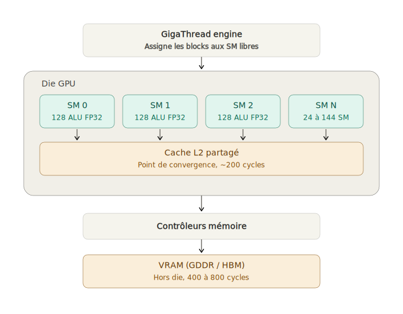
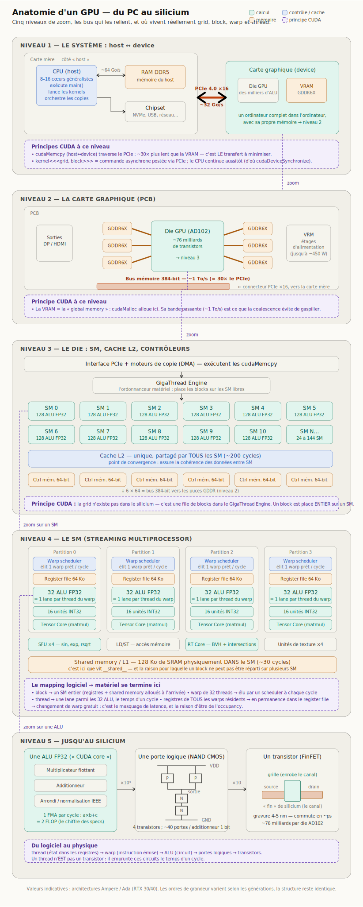
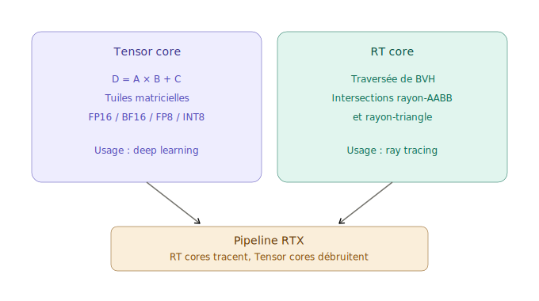
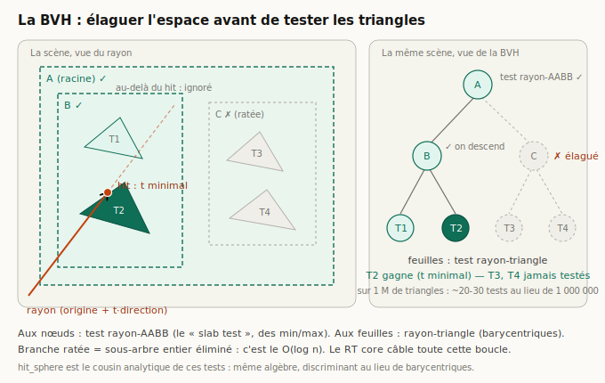
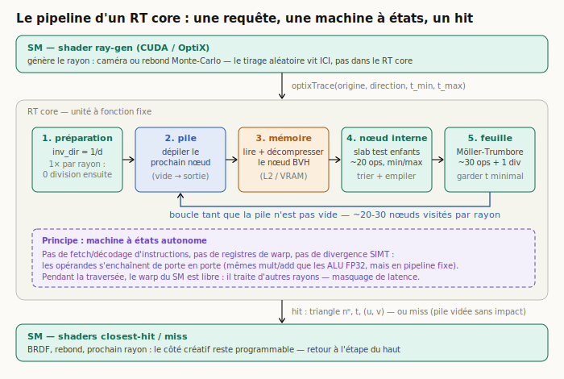

# Du kernel CUDA au photon : notes de recherche personnelles

*Document de synthèse tiré de mon journal de questions ([notes.md](notes.md)), rédigé en suivant le
[cuda-course d'Infatoshi](https://github.com/Infatoshi/cuda-course) et en préparant le portage CUDA de
*Ray Tracing in One Weekend*. Chaque section part d'une question que je me suis réellement posée ;
la réponse est la synthèse qui m'a débloqué.*

**Sommaire**

1. [Le modèle d'exécution CUDA : logique vs matériel](#1-le-modèle-dexécution-cuda--logique-vs-matériel)
2. [Le warp : la vraie unité d'exécution](#2-le-warp--la-vraie-unité-dexécution)
3. [Synchronisation et intégrité : barrières, races et ECC](#3-synchronisation-et-intégrité--barrières-races-et-ecc)
4. [Anatomie du GPU : CUDA cores, SM et hiérarchie mémoire](#4-anatomie-du-gpu--cuda-cores-sm-et-hiérarchie-mémoire)
5. [Où le langage CUDA est-il réellement utilisé ?](#5-où-le-langage-cuda-est-il-réellement-utilisé-)
6. [RT Cores et Tensor Cores](#6-rt-cores-et-tensor-cores)
7. [Ray tracing, path tracing et Monte-Carlo](#7-ray-tracing-path-tracing-et-monte-carlo)
8. [Et si on simulait Maxwell ?](#8-et-si-on-simulait-maxwell-)
9. [Physique réelle vs simulation : le parallèle](#9-physique-réelle-vs-simulation--le-parallèle)
10. [Feuille de route](#10-feuille-de-route)

---

## 1. Le modèle d'exécution CUDA : logique vs matériel

> *« La grid ne fait pas forcément la taille de toute la matrice de CUDA cores ? »*
> *« Le découpage blocks et grid c'est purement logique ? »*

**L'idée qui débloque tout : la grid est une structure logique, sans aucun lien dimensionnel avec le
matériel.** Quand on lance `kernel<<<gridDim, blockDim>>>`, on dimensionne la grid par rapport au
**problème** (une matrice 4096×4096, une image 400×225), jamais par rapport au GPU. On peut lancer des
millions de threads sur un GPU qui n'a que 5 000 ALU.



Le mécanisme de placement :

1. La grid est découpée en blocks ; chaque block est assigné **entier** à un SM (jamais réparti).
2. Un SM n'héberge qu'un nombre limité de blocks résidents (registres, shared memory, limites
   architecturales : ~16-32 blocks, 1024-2048 threads par SM).
3. Les blocks excédentaires **attendent en file** dans le GigaThread Engine ; dès qu'un block
   termine, un nouveau est placé.
4. Dans le SM, les threads sont exécutés par **warps** de 32.

D'où le pattern universel de dimensionnement, et son garde-fou :

```c
int blocks = (N + threadsPerBlock - 1) / threadsPerBlock;   // arrondi supérieur
...
if (idx < N) { ... }   // neutralise les threads excédentaires du dernier block
```

Ce découplage garantit la **scalabilité transparente** : le même binaire tourne sur 20 SM ou 144 SM.
La contrepartie : aucune garantie d'ordre ni de simultanéité entre blocks, donc pas de
synchronisation globale intra-kernel (hors cooperative groups).

**Jusqu'où va le « purement logique » ?** Un thread CUDA n'est *pas* une unité d'exécution ni un
arrangement de transistors. C'est un **contexte** : ses registres (une tranche du register file), sa
position dans le warp (lane 0-31), et l'état partagé du warp (program counter, masque). Le thread
**emprunte** les ALU au cycle où son warp est élu par le scheduler ; au cycle suivant, les mêmes ALU
servent un autre warp. Grid et blocks n'existent que comme conventions d'adressage — le matériel ne
connaît que les SM et les warps :

| Concept logiciel | Réalité matérielle |
|---|---|
| grid | file de blocks en attente dans le GigaThread Engine |
| block | allocation de ressources sur UN SM (registres + shared memory) + découpage en warps |
| warp | première entité réellement manipulée par le matériel |
| thread | une lane (0-31) d'un warp |

Analogie qui me parle : grid/block sont à CUDA ce que Deployment/Pod sont à Kubernetes — des
abstractions de placement que l'orchestrateur (GigaThread Engine) traduit en allocations sur les
nœuds physiques (SM). Personne ne trouvera une « grid » dans le die.

**Le renversement de perspective du kernel.** Le `for` du CPU et le `<<<blocks, threads>>>` du GPU
énumèrent le même espace d'itération — l'un dans le temps, l'autre dans l'espace. Le kernel décrit le
travail d'**un seul thread** (paradigme SPMD) :

```c
// CPU : une unité d'exécution, n itérations
for (int i = 0; i < n; i++) c[i] = a[i] + b[i];

// GPU : n threads, une "itération" chacun
__global__ void vectorAdd(float *a, float *b, float *c, int n) {
    int i = blockIdx.x * blockDim.x + threadIdx.x;
    if (i < n) c[i] = a[i] + b[i];
}
```

Quand `n` dépasse la grid maximale (ou pour l'efficacité), le pattern **grid-stride loop** fait
traiter plusieurs éléments par thread : `for (int i = ...; i < n; i += gridDim.x * blockDim.x)`.

---

## 2. Le warp : la vraie unité d'exécution

> *« La notion de warp et "wesp"… le "weft" pardon, j'ai pas vraiment compris. »*

D'abord l'étymologie qui m'avait embrouillé : sur un métier à tisser, la **chaîne** (*warp*) désigne
les fils tendus parallèlement, la **trame** (*weft*) le fil perpendiculaire. NVIDIA a emprunté
« warp » à cette image — 32 threads « tissés » ensemble, exécutés de front. **Seul « warp » a un sens
en CUDA** ; « weft » n'apparaît dans aucune doc NVIDIA. (À ne pas confondre non plus avec le
**wavefront**, l'équivalent AMD : 64 threads sur GCN, 32/64 sur RDNA.)

**Le modèle SIMT** (Single Instruction, Multiple Threads) : le SM regroupe les threads d'un block en
paquets de 32 threads **consécutifs** (0-31, 32-63…). À chaque cycle, les 32 threads d'un warp
exécutent la **même instruction**, chacun sur ses propres données. Un block de 256 threads = 8 warps
du point de vue du matériel.

**Le warp scheduler et le masquage de latence.** Chaque SM a 4 warp schedulers. À chaque cycle,
chacun choisit un warp **prêt** (opérandes disponibles) et émet son instruction. Quand un warp attend
une lecture mémoire (400-800 cycles), le scheduler bascule instantanément sur un autre — changement de
contexte **gratuit**, car les registres de tous les warps résidents restent en permanence dans le
register file. D'où l'importance de l'**occupancy** : plus de warps résidents = plus de candidats pour
combler les temps morts.

Deux conséquences pratiques qui conditionneront directement le path tracer :

- **Divergence de branche** : si dans un même warp certains threads prennent le `if` et d'autres le
  `else`, les deux chemins s'exécutent **séquentiellement** (threads inactifs masqués).
  `if (threadIdx.x % 2 == 0)` divise le débit par deux ; une condition alignée sur les frontières de
  warp (`if (threadIdx.x < 32)`) ne diverge pas.
- **Coalescence mémoire** : les transactions sont émises à l'échelle du warp. 32 threads → 32
  adresses contiguës = 1 transaction ; accès dispersés = jusqu'à 32. C'est ce qui rend optimal le
  pattern `idx = blockIdx.x * blockDim.x + threadIdx.x` avec accès `data[idx]`.

Corollaire : `blockDim` toujours multiple de 32. Un block de 33 threads consomme 2 warps, dont le
second n'a qu'un thread actif sur 32.

---

## 3. Synchronisation et intégrité : barrières, races et ECC

> *« Sans synchronisation il y aurait des erreurs de calcul, car une tâche dépend du résultat d'une
> autre. »*

Exact — et la sortie de `01_idxing` le montre concrètement : les 1536 threads impriment leurs id
**dans le désordre** (l'ordre reflète l'ordonnancement réel des warps, jamais la numérotation). Ça ne
pose aucun problème à `idxing` ou `vectorAdd` parce qu'aucun thread n'y dépend d'un autre
(*embarrassingly parallel*). Dès qu'une dépendance apparaît, il faut une **barrière** — et CUDA en
fournit une par étage de la hiérarchie de la section 1 :

| Portée | Mécanisme | Coût |
|---|---|---|
| warp (32 threads) | `__syncwarp()` | ~gratuit |
| block | `__syncthreads()` | quelques cycles |
| grid entière | fin du kernel (ou cooperative groups) | relancement |
| host ↔ device | `cudaDeviceSynchronize()`, streams/events | vidage du pipeline |

**`__syncthreads()` — la barrière de block.** Tous les threads du block s'arrêtent à cette ligne
jusqu'à ce que le dernier y arrive, et les écritures en shared memory faites avant deviennent
visibles de tous après. Le cas d'école est le tiling de la matmul (chapitre 07 du cours) :

```c
__shared__ float tile[32][32];
tile[ty][tx] = A[...];        // chaque thread charge UNE case de la tuile
__syncthreads();              // barrière : la tuile doit être complète...
somme += tile[ty][k] * ...;   // ...car on lit des cases chargées par d'AUTRES threads
__syncthreads();              // et ne pas écraser la tuile pendant qu'un autre la lit
```

Sans la première barrière : lecture de cases pas encore écrites — **race condition**. Le symptôme
est vicieux : résultats faux ET non reproductibles, puisqu'ils dépendent de l'ordonnancement des
warps du moment. Piège classique : `__syncthreads()` placé dans un `if` divergent — les threads qui
ne passent pas par la barrière laissent les autres attendre pour toujours (deadlock/indéfini).

**Trois nuances importantes :**

- *Intra-warp* : historiquement les 32 threads avançaient en lockstep (synchronisation implicite).
  Depuis Volta, chaque thread a son propre program counter — d'où `__syncwarp()` quand des lanes
  échangent des données (`__shfl_sync`).
- *Entre blocks* : **pas de barrière intra-kernel** (conséquence directe de la section 1 : aucune
  garantie d'ordre entre blocks). La barrière globale, c'est la **fin du kernel** : un kernel lancé
  après un autre voit tout ce que le premier a écrit. Pour les agrégations concurrentes :
  `atomicAdd` et famille.
- *Host* : le lancement étant asynchrone, `cudaDeviceSynchronize()` est la barrière CPU↔GPU (déjà
  rencontrée dans `01_idxing` pour vider le buffer des printf).

**Et l'ECC ?** C'est l'autre famille d'erreurs. La synchronisation protège des erreurs **logiques**
(races — c'est au programmeur de les éliminer). L'ECC (*Error-Correcting Code*) protège des erreurs
**physiques** : un bit qui bascule spontanément en mémoire sous l'effet d'une particule (rayon
cosmique, particule alpha de l'emballage) ou d'une cellule marginale. Rare par bit, mais sur des
dizaines de Go pendant des heures de calcul, la probabilité devient réelle. La mémoire ECC stocke
des bits de contrôle supplémentaires (schéma SECDED : corrige toute erreur de 1 bit, détecte celles
de 2). C'est un équipement **datacenter** : A100/H100 (HBM avec ECC natif), gammes pro ; les GeForce
n'en ont pas (le GDDR6X ne protège que la liaison, pas les cellules). Conséquence pratique : un bit
flip dans mon path tracer = un pixel faux au milieu du bruit Monte-Carlo — invisible et écrasé à
l'image suivante ; le même bit flip dans une FDTD de 72 h = un résultat potentiellement faux sans
aucun symptôme. L'ECC se paie (bande passante/capacité) et se justifie quand le coût d'un résultat
silencieusement corrompu dépasse celui du matériel.

---

## 4. Anatomie du GPU : CUDA cores, SM et hiérarchie mémoire

> *« Je vois pas le lien avec les fameux CUDA core count qu'on nous vend sur la fiche produit ? Et un
> SM c'est une unité de traitement autonome reliée à la mémoire locale et la VRAM ? »*

**Le « CUDA core » est un terme marketing.** Ce n'est pas un cœur au sens CPU — c'est une simple
**ALU FP32** : une addition/multiplication flottante 32 bits par cycle, aucune autonomie, ne décode
rien. Le chiffre de la fiche produit = **nombre de SM × ALU FP32 par SM** (RTX 4090 : 128 SM × 128 =
16 384 ; RTX 4060 : 24 × 128 = 3 072). Le vrai « cœur », celui qui possède l'intelligence
(schedulers, registres, mémoire), c'est le **SM**.



Composition d'un SM (valeurs Ampere/Ada, structure identique ailleurs) :

- **4 warp schedulers** — sélectionnent et émettent les instructions ;
- **register file ~256 Ko** — les registres privés de tous les threads résidents ; ressource la plus
  rapide et la plus contraignante pour l'occupancy ;
- **shared memory / L1 ~128 Ko** — SRAM physiquement DANS le SM, partitionnable entre les deux
  usages. C'est précisément pourquoi un block ne peut pas être réparti sur plusieurs SM : sa shared
  memory vit dans un SM unique ;
- unités d'exécution : 128 ALU FP32 (« CUDA cores »), unités INT32, **Tensor Cores**, **SFU**
  (sin, exp, rsqrt…), unités load/store.

**Le SM n'est PAS relié directement à la VRAM.** Le chemin est hiérarchique :

```
Thread → registres            (par thread,        ~1 cycle)
       → shared memory / L1   (par SM,           ~30 cycles)
       → L2                   (partagé par TOUS, ~200 cycles)
       → contrôleurs mémoire → VRAM GDDR/HBM  (~400-800 cycles)
```

Le L2 est le point de convergence de tous les SM et assure la cohérence entre eux. Cette asymétrie —
shared memory locale et rapide vs VRAM globale et lente — est la motivation du **tiling** (chapitre
07 du cours) : charger des tuiles de VRAM en shared memory pour les réutiliser.

Le schéma anatomique complet, du PC au transistor, avec les bus qui relient chaque étage :



Lecture combinée : la fiche produit multiplie les boîtes vertes (SM) par les 128 ALU qu'elles
contiennent et appelle ça « CUDA cores ». L'intelligence (schedulers, register file, shared memory)
et le goulot d'étranglement (L2 → VRAM, et plus encore PCIe) n'apparaissent jamais sur la fiche —
alors que ce sont eux qui déterminent la performance réelle d'un kernel.

---

## 5. Où le langage CUDA est-il réellement utilisé ?

> *« Concrètement le langage CUDA est utilisé où et quand ? Un contrôle aussi bas niveau est utilisé
> dans l'API DirectX, non, ou rien à voir ? »*

**La majorité des développeurs GPU n'écrivent jamais de CUDA.** PyTorch/TensorFlow délèguent à
cuBLAS (matmul), cuDNN (convolutions, attention), NCCL (multi-GPU) — des kernels écrits et optimisés
par NVIDIA. On écrit du CUDA à la main quand on sort des sentiers battus :

- **recherche ML** : opérateurs custom — FlashAttention est l'exemple canonique ;
- **inférence LLM** : vLLM, TensorRT-LLM, llama.cpp — PagedAttention, quantification, sampling ;
- **HPC/simulation** : dynamique moléculaire, CFD, météo, finance (Monte-Carlo), génomique ;
- **rendu et signal** : DaVinci Resolve, reconstruction médicale, radioastronomie.

Tendance actuelle : une partie de ce travail migre vers **Triton** (~80-90 % de la performance pour
une fraction de l'effort), CUDA restant le dernier décile d'optimisation.

**Le rapport avec DirectX.** Même silicium, finalité différente. DirectX est d'abord une API
*graphique* (pipeline de rendu : vertex shaders, rasterisation, pixel shaders) — on n'y raisonne pas
en warps mais en draw calls. La comparaison pertinente est avec les **compute shaders**
(DirectCompute, Vulkan, OpenCL, Metal) dont le modèle est quasi identique à CUDA :

| CUDA | Compute shaders (HLSL/GLSL) |
|---|---|
| thread | thread |
| block | thread group |
| grid | dispatch |
| shared memory | groupshared memory |

Différences déterminantes : DirectX/Vulkan sont **portables** (AMD, Intel, NVIDIA) ; CUDA est
propriétaire mais expose le matériel sans intermédiaire (Tensor Cores via WMMA, primitives de warp
`__shfl_sync`, etc.) et surtout possède l'écosystème (cuBLAS, cuDNN, Nsight, NCCL) sans équivalent.
En pratique les domaines sont disjoints : compute shaders pour le calcul au service du rendu dans les
moteurs de jeu ; CUDA pour le ML et le HPC.

---

## 6. RT Cores et Tensor Cores

> *« Les RT cores et Tensor cores sont dispo sur ma machine, les deux utilisent des circuits de
> multiplication de matrices, l'un pour le tracé de rayons et l'autre pour le deep learning. »*

Confusion à corriger : **les RT cores ne sont pas des multiplicateurs de matrices.**



- **Tensor Cores** : effectivement des multiplicateurs-accumulateurs matriciels (D = A×B + C sur des
  tuiles, en FP16/BF16/FP8/INT8), conçus pour le deep learning.
- **RT Cores** : unités à fonction fixe pour deux opérations toutes différentes — la **traversée de
  BVH** (l'arbre spatial qui organise la scène) et les **tests d'intersection** rayon-AABB et
  rayon-triangle. Des comparateurs et unités géométriques câblés. Leur raison d'être : la traversée
  d'arbre est un code très **divergent** (chaque rayon suit son propre chemin dans le BVH), donc
  catastrophique pour le modèle SIMT de la section 2 — la câbler en dur libère les SM.

Dans un pipeline de rendu moderne, les deux collaborent : les RT cores tracent, les Tensor Cores
**débruitent** (le path tracing à faible nombre d'échantillons est bruité ; un réseau de neurones
nettoie — denoiser OptiX, DLSS Ray Reconstruction).

### La BVH et sa traversée, en détail

Le problème : une scène réelle = des millions de triangles (en production tout est maillé en
triangles — la sphère analytique de `hit_sphere` est un luxe pédagogique). Tester chaque triangle
pour chaque rayon = O(n), impraticable. La **BVH** (*Bounding Volume Hierarchy*) est un arbre
binaire de **boîtes englobantes** : la racine englobe toute la scène, chaque nœud englobe ses deux
enfants, et les feuilles contiennent quelques triangles. Construction (avant le rendu) : englober,
couper le groupe en deux, récurser.



La traversée, pour un rayon donné :

1. tester la boîte racine ; ratée → aucun objet touché, terminé ;
2. touchée → tester les deux boîtes enfants. **Une boîte ratée élimine tout son sous-arbre d'un
   coup** — des milliers de triangles écartés par un seul test : c'est l'origine du O(log n) ;
3. quand les deux enfants sont touchés, en visiter un, empiler l'autre (d'où une **pile** par rayon) ;
4. aux feuilles : tests rayon-triangle, on garde le **t minimal** (le premier impact — même logique
   que la petite racine de `hit_sphere`).

C'est cette boucle — branchements imprévisibles, pile, accès mémoire dispersés dans l'arbre — qui
est catastrophique en SIMT, et que le RT core câble intégralement.

### Les trois tests d'intersection : même famille d'algèbre

| Test | Méthode | Opérations | Qui l'exécute |
|---|---|---|---|
| rayon-**AABB** | « slab test » : la boîte = intersection de 3 tranches alignées sur les axes ; t d'entrée/sortie par axe ; touché ssi max(entrées) ≤ min(sorties) | soustractions, multiplications par 1/d précalculé, min/max — pas de discriminant | RT core (nœuds) |
| rayon-**triangle** | Möller-Trumbore : exprimer l'impact en coordonnées barycentriques (u,v) via produits vectoriels ; touché ssi u ≥ 0, v ≥ 0, u+v ≤ 1, t > 0 | produits scalaires/vectoriels, 1 division | RT core (feuilles) |
| rayon-**sphère** | notre `hit_sphere` : polynôme du 2nd degré, discriminant h²−ac | produits scalaires, 1 sqrt, 1 division | ALU du SM (primitive custom) |

Le test AABB a le droit d'être grossier : il ne décide rien de définitif, il ne fait qu'**éliminer**.
La précision géométrique n'est exigée qu'aux feuilles.

### Au passage : pourquoi `hit_sphere` calcule h et pas b

> *« Tu peux me réexpliquer pourquoi il [Shirley] dit que b = −2h pour simplifier la fonction ? »*

Le point qui trompe : il ne « décide » pas que b = −2h — le −2 est **déjà dans b**,
structurellement. Développer (C − Q − t·d)·(C − Q − t·d) = r² fait sortir le terme croisé avec son
facteur 2, comme dans (x−y)² = x² **− 2xy** + y² : b = −2·d·(C−Q) est une fatalité algébrique de ce
problème. Poser h = −b/2 = d·(C−Q) ne fait que nommer la partie utile. Injecté dans la formule des
racines, les constantes s'annulent alors en cascade :

```
t = (−b ± √(b² − 4ac)) / 2a
  = (2h ± √(4h² − 4ac)) / 2a      car −(−2h) = 2h et (−2h)² = 4h²
  = (2h ± 2·√(h² − ac)) / 2a      le √4 = 2 sort de la racine
  = (h ± √(h² − ac)) / a          tout se divise par 2
```

Dans le code, on ne fabrique donc jamais le −2 pour le combattre ensuite : `h = dot(direction, oc)`
directement, discriminant `h*h - a*c` (c'est b²−4ac divisé par 4 — même signe, le test `< 0` garde
exactement le même sens), racine `(h - sqrt(disc)) / a`. Une multiplication, une négation et un
facteur 4 éliminés de la fonction la plus appelée du rendu (cf. les 2×10¹⁰ requêtes ci-dessous).
Bonus : avec `oc = center − origin` = C−Q, le signe moins disparaît du code aussi, pas seulement
des maths.

### Le lien avec Monte-Carlo

L'estimateur de la section 7 est ce qui transforme l'intersection en déluge. Compter les requêtes :
N échantillons par pixel × plusieurs segments par chemin (un par rebond, plus les rayons d'ombre de
la next event estimation). Image 1920×1080, 1 000 spp, ~5 rebonds : ~2×10⁶ × 10³ × 10 ≈ **2×10¹⁰
traversées de BVH par image**. Chaque terme de la moyenne Monte-Carlo se paie en traversées.

Plus profond : **c'est Monte-Carlo qui rend la traversée divergente.** Le ray tracing déterministe
de Whitted produit des rayons voisins quasi parallèles (mêmes directions de réflexion) : ils suivent
presque le même chemin dans l'arbre, le SIMT survit. Le path tracing tire des directions
**aléatoires** : dès le premier rebond, deux rayons d'un même warp sont décorrélés et explorent des
branches différentes. L'aléa — la force statistique de la méthode — est exactement ce qui casse le
modèle d'exécution de la section 2. Le RT core est la réponse matérielle au coût de l'échantillonnage,
comme le Tensor core (denoiser) est la réponse matérielle à sa variance : **les deux unités « RTX »
sont les deux moitiés du prix de Monte-Carlo.**

### Comment on les pilote — et ce que « contrôler » veut dire

**Les RT cores ne sont pas exposés en CUDA pur** : aucune instruction CUDA ne les invoque. La voie
NVIDIA est **OptiX**, une API au-dessus de CUDA qui répartit le travail de part et d'autre de la
frontière fixe/programmable :

- *moi, en CUDA C++* : les shaders — ray generation (caméra, échantillonnage Monte-Carlo),
  closest-hit (BRDF, rebond), miss (ciel). Le côté créatif, sur les SM ;
- *OptiX + RT cores* : `optixTrace(rayon)` → construction de la BVH, traversée, tests, retour du
  hit le plus proche. Le côté fixe, câblé.

Le code utilisateur est effectivement **simplifié** : toute la boucle de traversée (pile, AABB,
triangles) disparaît — on fournit la géométrie, on appelle `optixTrace`, on récupère le hit.
Alternatives hors CUDA : DXR / Vulkan Ray Tracing, mêmes RT cores via les API graphiques.

### Le RT core câble-t-il un arbre de décision ?

> *« Le circuit du RT core câble un arbre de décision (souvent binaire) en dur, et les données qui
> circulent dedans, c'est de l'échantillonnage aléatoire ? »*

Presque — trois retouches rendent l'image exacte :

1. **Le circuit ne câble pas l'arbre, il câble la *traversée*.** La BVH est une **donnée** : elle vit
   en VRAM, reconstruite par le driver pour chaque scène. Ce qui est figé en silicium, c'est la
   boucle de parcours (charger un nœud, slab test, choisir la branche, empiler). Même circuit, arbre
   différent à chaque scène — comme un additionneur câblé dont les opérandes restent libres.
2. **Pas un arbre de décision au sens strict.** Un arbre de décision se parcourt en un seul chemin
   racine→feuille. Ici, quand le rayon touche les **deux** boîtes filles, on descend dans les deux
   (l'une tout de suite, l'autre empilée pour plus tard) : c'est une *recherche avec élagage et
   backtracking*, pas une classification. Et le matériel réel utilise souvent des nœuds plus larges
   que binaires (4-8 enfants, compressés) pour amortir les lectures mémoire.
3. **Ce qui circule, ce sont des rayons — l'aléatoire vit en amont.** Le RT core reçoit (origine,
   direction, t_min, t_max) et rend un hit ; il ignore totalement d'où vient le rayon. C'est le
   shader ray-gen, sur les SM, qui tire les directions de rebond au hasard (section 7). Division du
   travail : le SM décide *quels* rayons lancer — là est Monte-Carlo ; le RT core répond *ce qu'ils
   touchent* — là est la géométrie.

(Et « échantillonnage aléatoire » n'est pas un pléonasme : on peut aussi échantillonner en grille
régulière, stratifié ou quasi-aléatoire — les suites de Sobol, très utilisées en production,
convergent même mieux que le pur hasard.)

En formule : **circuit fixe (traversée + tests) × données variables (BVH en mémoire + rayons issus
de l'échantillonnage).**

### Concrètement, quelles opérations dans le circuit ?

> *« Concrètement ils font quoi comme opérations, les RT cores ? »*



Trois blocs, trois natures :

- **Test rayon-AABB (slab test)** — par axe : t d'entrée et de sortie de la « tranche », soit 2
  soustractions et 2 multiplications par `inv_dir` (l'inverse de la direction, calculé **une fois
  par rayon** puis réutilisé sur les dizaines de boîtes testées — zéro division dans la boucle),
  puis des min/max. Total ~20 opérations, aucune racine carrée. Cette frugalité est ce qui rend le
  test câblable — et ce qui permet d'éliminer des sous-arbres entiers à bas prix.
- **Test rayon-triangle (Möller-Trumbore)** — produits vectoriels et scalaires pour exprimer
  l'impact en coordonnées barycentriques (u, v) : ~30 multiplications/additions et 1 division.
  Cousin direct de `hit_sphere` : mêmes briques (dot, cross, soustractions), barycentriques au lieu
  du discriminant.
- **La machine à traverser** — le vrai gain, et ce n'est pas du calcul mais de la **logique de
  contrôle** : lire et décompresser un nœud, lancer les slab tests, trier les enfants (le plus
  proche d'abord), gérer la pile, enchaîner sur les feuilles, garder le t minimal, boucler jusqu'à
  pile vide. Elle remplace des centaines d'instructions SIMT (boucle, if, pile en registres) par une
  machine à états autonome — et pendant qu'elle mouline, le warp du SM traite d'autres rayons :
  masquage de latence par-dessus l'accélération brute.

Aucune de ces opérations n'est exotique — mêmes mult/add que les ALU FP32. Le gain vient du
**pipeline fixe** : pas de fetch/décodage d'instructions, pas de registres généraux, pas de
divergence de warp — les opérandes s'enchaînent de porte en porte.

---

## 7. Ray tracing, path tracing et Monte-Carlo

> *« Le ray tracing et path tracing utilisent la méthode de Monte-Carlo ? L'un est plus avancé que
> l'autre niveau algorithmique ? »*

**Ray tracing de Whitted (1980) : déterministe.** Un rayon par pixel ; à chaque intersection, seules
des directions parfaitement déterminées (réflexion miroir, réfraction de Snell, rayons d'ombre).
Aucun tirage aléatoire — deux exécutions donnent la même image. Limite : miroirs parfaits, verre
parfait, ombres dures. Pas de réflexions floues, pas d'ombres douces, pas d'**éclairage indirect**.

**Path tracing de Kajiya (1986) : Monte-Carlo appliqué à l'équation du rendu.**

```
L(x, ω) = Lₑ(x, ω) + ∫_Ω f(x, ω, ω′) · L(x, ω′) · cos θ′ dω′
```

Lecture : lumière quittant un point = ce qu'il **émet** (Lₑ — non nul uniquement sur les sources :
lampes, ciel) + ce qu'il **réfléchit** (l'intégrale sur l'hémisphère de toute la lumière incidente,
pondérée par le matériau — la BRDF f). Pas de solution analytique : l'intégrale est récursive (le L
de droite est l'inconnue) et de haute dimension. Monte-Carlo estime cette intégrale en tirant des
**directions aléatoires** à chaque rebond — des chemins caméra → scène → … → source (le sens
caméra-vers-source est légitimé par la réciprocité de Helmholtz) — et en moyennant N chemins par pixel.



**Pourquoi l'aléatoire, alors que la lumière suit des lois déterministes ?** L'aléatoire ne modélise
pas la lumière — c'est un **artifice d'intégration numérique**. L'alternative déterministe (quadrature :
découper l'hémisphère en cases régulières et sommer, un Riemann multidimensionnel) s'effondre à cause
de la **malédiction de la dimensionnalité**.

**D'où viennent les N dimensions ?** On compte les nombres aléatoires nécessaires à UN chemin :
2 par direction de rebond (deux angles) × 5 rebonds = 10, plus la position dans le pixel (2),
l'objectif (2), l'instant (1)… Un chemin = un point dans un espace à 10-15 dimensions ; la couleur
du pixel est une intégrale dans cet espace. Une grille de 10 subdivisions par dimension en dimension
10 = 10¹⁰ évaluations **par pixel**. Monte-Carlo, lui, converge en **1/√N indépendamment de la
dimension**.

**D'où vient le 1/√N ?** De la statistique élémentaire — l'estimateur est une moyenne de N tirages
indépendants, comme un sondage. Chaque tirage a une variance σ² ; les variances de tirages
indépendants s'additionnent ; la moyenne a donc une variance σ²/N, et l'erreur typique (le bruit
visible) vaut **σ/√N**. Règle pratique : ×4 échantillons = bruit ÷2. C'est cette convergence lente
qui justifie économiquement le denoiser neuronal sur Tensor Cores.

**Toute la recherche du domaine = réduire la variance sans biaiser** — exploiter le fait que la
lumière suit un « pattern » : importance sampling (échantillonner où la BRDF est forte), next event
estimation (connecter chaque rebond aux sources), MIS (Veach 1997), russian roulette, et jusqu'à
ReSTIR (2020, temps réel). Le hasard résiduel ne sert plus qu'à garantir l'absence de biais.

Alternatives historiques et actuelles à Monte-Carlo : radiosité (déterministe, éléments finis,
limitée au diffus), photon mapping (stochastique mais biaisé, excellent pour les caustiques),
solutions analytiques partielles (LTC, harmoniques sphériques), approximations temps réel (voxel cone
tracing, Lumen). Consensus : Monte-Carlo pour la référence et le cinéma, hybrides pour le temps réel.

Vocabulaire : ce que NVIDIA vend sous « RTX » est du path tracing partiel ou complet, débruité.
*Ray Tracing in One Weekend* est, malgré son titre, un **path tracer** — l'estimateur Monte-Carlo
arrive dès le premier volume (implicitement : directions aléatoires + moyenne), le formalisme complet
(PDF, importance sampling) dans le volume 3.

---

## 8. Et si on simulait Maxwell ?

> *« C'est possible de simuler les équations de Maxwell, pour tenter de reproduire la propagation de
> la lumière ? »*

Oui — c'est l'**électromagnétisme computationnel** — mais à des échelles minuscules, pour une raison
quantitative implacable.

La méthode emblématique est la **FDTD** (Finite-Difference Time-Domain, algorithme de Yee, 1966) :
grille 3D de cellules stockant les champs E et H, avancés pas de temps par pas de temps. Aucune
approximation physique : diffraction, interférences, polarisation émergent naturellement.



Détail qui me concerne : la FDTD est un stencil régulier sur grille — un des problèmes les **plus
parfaitement adaptés au GPU** (accès coalescés, zéro divergence). Meep ou Lumerical exploitent CUDA
ainsi.

**Pourquoi on ne rend pas une scène avec Maxwell :** le rapport d'échelle. λ visible ≈ 500 nm, et la
FDTD exige 10-20 cellules par longueur d'onde. Pour **1 cm³** : 20 000 λ par dimension × 20 cellules
= 400 000 cellules par dimension, soit ~6×10¹⁶ cellules × 6 composantes de champ → de l'ordre de
l'**exaoctet**, et des centaines de milliers de pas de temps. Une pièce entière : +6 ordres de
grandeur. Le nombre d'inconnues croît en (taille/λ)³ — hors de portée de tout calculateur prévisible.

Où Maxwell est réellement simulé : photonique intégrée, métasurfaces, plasmonique, antennes/radar
(λ en cm : objets entiers simulables — HFSS, CST), CEM, furtivité (surface équivalente radar).

**L'articulation avec le rendu** — le point qui referme la boucle :



L'optique géométrique (les rayons) est la **limite asymptotique** de Maxwell quand λ → 0 devant les
dimensions de la scène. Le path tracing n'est donc pas une approximation grossière : c'est le régime
correct à l'échelle macroscopique. Les effets ondulatoires qui subsistent (irisation des bulles de
savon, reflets d'un CD, plumages) sont traités en **hybride** : la réponse ondulatoire du matériau
est résolue analytiquement ou pré-calculée, puis injectée comme BRDF dans le path tracer. *L'onde
fournit le coefficient ; le rayon transporte l'énergie.*

Et la nature, elle, ne calcule rien : elle *est* l'intégrale, réalisée par ~10¹⁷ photons/s. Le rendu
inverse le problème (tracer depuis la caméra, réciprocité de Helmholtz) puis échantillonne ce
continuum. Monte-Carlo est la transposition numérique honnête de la force brute de la nature.

---

## 9. Physique réelle vs simulation : le parallèle

*(Synthèse transversale des sections 7 et 8 — le fil qui relie le GPU à la physique qu'il simule.)*

**La nature calcule localement et en parallèle.** Rien dans l'univers n'attend son tour : chaque
photon avance pendant que tous les autres avancent, et le champ électromagnétique en un point
n'évolue qu'en fonction de ses voisins immédiats (les équations de Maxwell sont des lois *locales*).
Le GPU reprend exactement cette philosophie : des milliers d'unités qui appliquent la même règle
locale à des données différentes. Vu ainsi, c'est le CPU séquentiel qui est l'anomalie — et c'est
pourquoi la FDTD (chaque cellule ne regarde que ses voisines) et le path tracing (chaque rayon
indépendant) se portent si naturellement sur GPU.

| Physique réelle | Simulation sur GPU |
|---|---|
| espace-temps continu | grille discrète (FDTD : Δx ≈ λ/20, Δt borné par la stabilité) |
| lois locales (Maxwell) | stencil : une cellule mise à jour depuis ses voisines |
| ~10¹⁷ photons/s sur une scène | N échantillons par pixel (Monte-Carlo) |
| grandeurs continues, précision « infinie » | flottants IEEE 754 : arrondi à chaque opération |
| parallélisme total (tout évolue à la fois) | parallélisme massif mais fini : SM × warps, le GigaThread sérialise le surplus |
| l'énergie explore toutes les directions | importance sampling : tirages concentrés là où l'énergie est |
| lois déterministes | déterminisme à graine fixée (cuRAND) : exécution reproductible |

**Le bruit est le même des deux côtés.** Le grain d'une photo prise en basse lumière est du *shot
noise* : la fluctuation statistique du petit nombre de photons captés par chaque pixel pendant la
pose. C'est exactement le 1/√N de la section 7. Un capteur photo et un path tracer sont deux
estimateurs Monte-Carlo du même flux lumineux — l'un échantillonne des photons réels, l'autre des
chemins simulés. Doubler le temps de pose et quadrupler les échantillons par pixel obéissent à la
même loi ; et le denoiser neuronal d'un smartphone en basse lumière joue le même rôle que celui
d'OptiX.

**Deux stratégies pour simuler la même physique.** Simuler le *mécanisme* : la FDTD fait vivre
l'onde elle-même, et diffraction/interférences **émergent** — fidélité maximale, coût en (taille/λ)³,
donc cantonnée au micromètre. Ou simuler le *résultat* : le path tracing échantillonne directement
les chemins d'énergie dans le régime où λ est négligeable — c'est la limite asymptotique de la
section 8. Entre les deux, l'hybride : l'onde fournit le coefficient (BRDF pré-calculée), le rayon
transporte l'énergie.

**La nature n'a pas de barres d'erreur ; la simulation en a quatre.** Chacune avec son remède :

1. **discrétisation** (grille trop grossière) → raffiner, au coût cubique ;
2. **statistique** (variance Monte-Carlo) → 1/√N, importance sampling, denoiser ;
3. **arrondi** (float32 ≈ 7 chiffres significatifs) → float64 quand nécessaire, ordre des
   opérations, sommation compensée ;
4. **matérielle** (bit flips) → l'ECC de la section 3.

Les trois premières sont des choix d'échantillonnage du continu ; la quatrième rappelle que le
simulateur est lui-même un objet physique — des transistors du niveau 5 du
[schéma anatomique](diagrams/gpu_anatomie_bus.svg), soumis aux mêmes particules que le reste de
l'univers qu'ils simulent.

---

## 10. Feuille de route

Parcours retenu (validé section par section dans les notes) :

1. **[en cours]** *Ray Tracing in One Weekend* (Peter Shirley) en C++ séquentiel, tel qu'écrit —
   c'est `src/raytracer/`. Maths requises : produits scalaires/vectoriels, équations du 2nd degré
   (intersection rayon-sphère). La théorie de l'intégration reste en coulisses :
   `couleur += echantillon; couleur /= N;`.
2. **Portage CUDA** en suivant l'article de Roger Allen, *Accelerated Ray Tracing in One Weekend in
   CUDA* (blog NVIDIA, 2018 ; dépôt `rogerallen/raytracinginoneweekendincuda`). Les points de
   friction attendus sont exactement les notions des sections 1-4 :
   - la boucle sur les pixels devient un kernel 2D (un thread par pixel) ;
   - `rand()` → **cuRAND**, un état de générateur par thread ;
   - la récursion de `ray_color()` → boucle itérative (pile device très limitée) ;
   - scène en mémoire device : `cudaMalloc`, pointeurs device, écueils des fonctions virtuelles ;
   - la divergence de warp devient **mesurable** (rayons voisins → matériaux/chemins différents).
   Benchmark CPU vs GPU attendu : ×20 à ×80.
3. **OptiX** pour exploiter RT cores et denoiser (section 6).
4. Optionnel : comparaison compute shader Vulkan pour la portabilité (section 5).

---

*Sources : cuda-course (Infatoshi) ; discussions consignées dans [notes.md](notes.md) ;
Shirley, «Ray Tracing in One Weekend» ; Allen, «Accelerated Ray Tracing in One Weekend in CUDA» ;
Kajiya 1986, «The Rendering Equation» ; Veach 1997 ; Yee 1966.*
